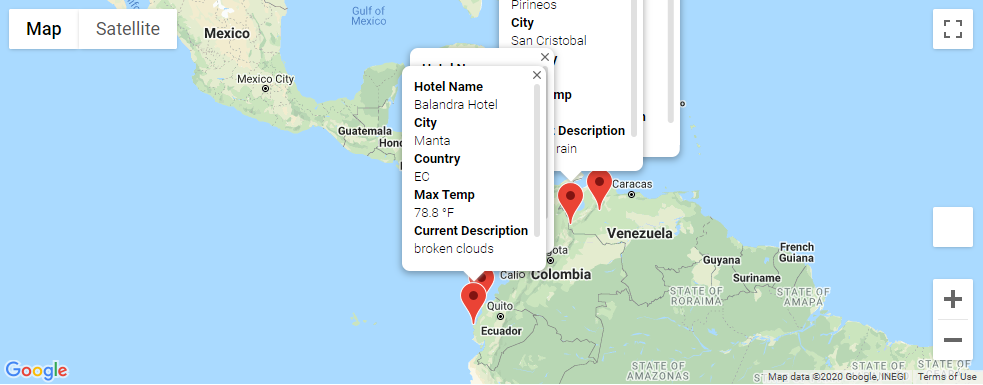
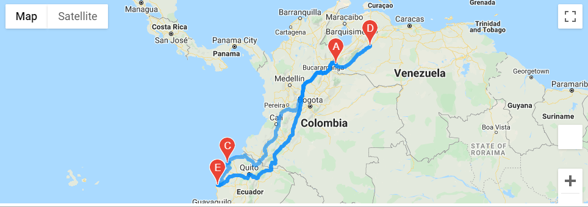

# World_Weather_Analysis
## Deliverable 1
In the first deliverable, I created a dataframe using Pandas and by making an API call. The data collected includes latitude and longitude, maximum temperature, percent humidity, percent cloudiness, wind speed, and weather description. After gathering this info, I exported it to a csv. 

## Deliverable 2
In the second deliverable, I imported the dataframe created in deliverable 1 so I could continue using it. I altered it to take customer input on weather preferences, then used those preferences to identify potential travel destinations and nearby hotels. Then I displayed those destinations on a marker layer map with pop up markers. 

## Deliverable 3
In the final step I used the Google Directions API to create a travel itinerary to show the route between four cities from the customer's possible travel destinations. There's also a marker layer map with a pop up marker for each city. 

